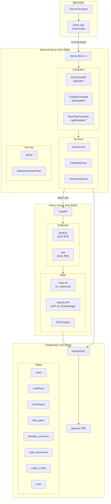
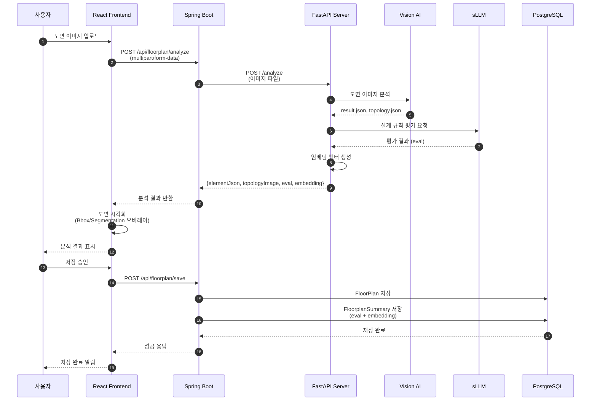
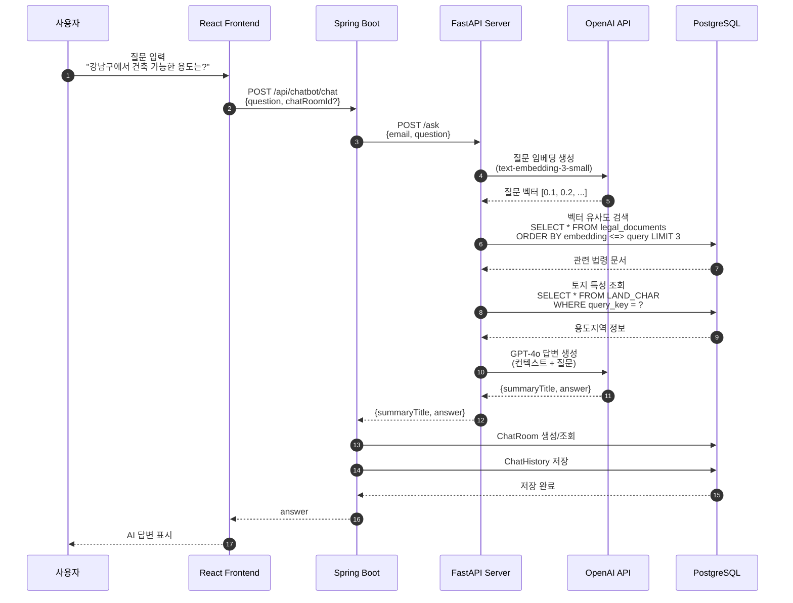
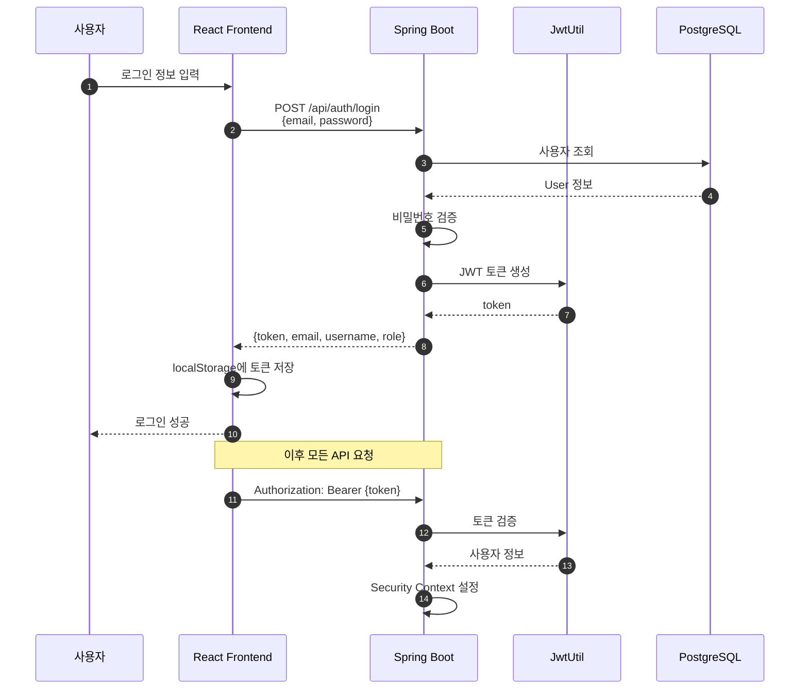
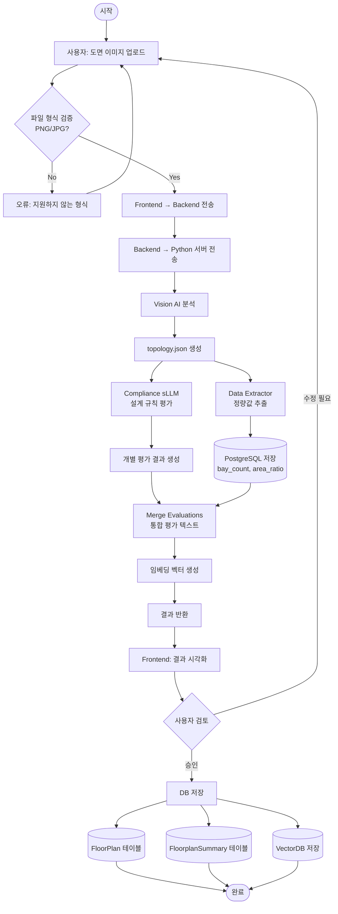
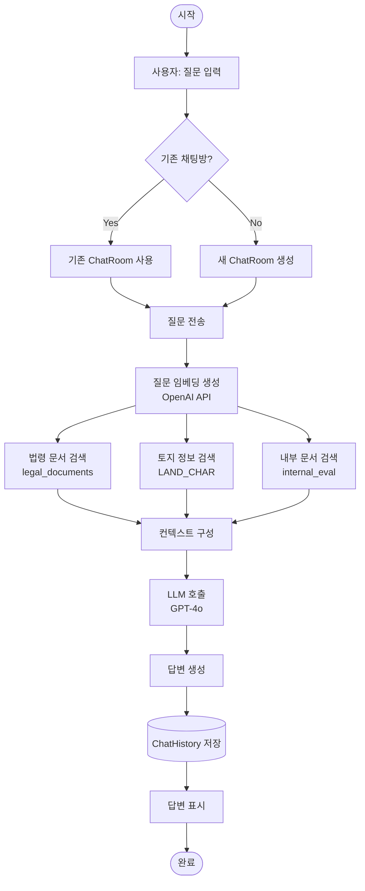
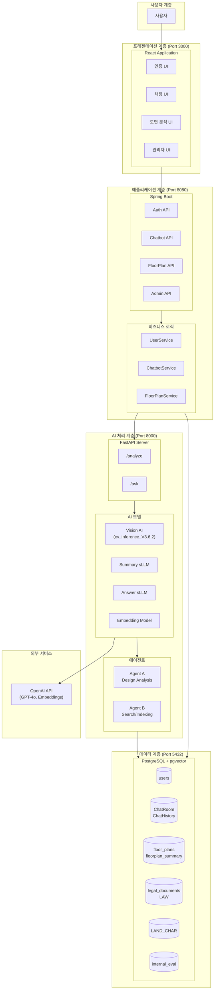
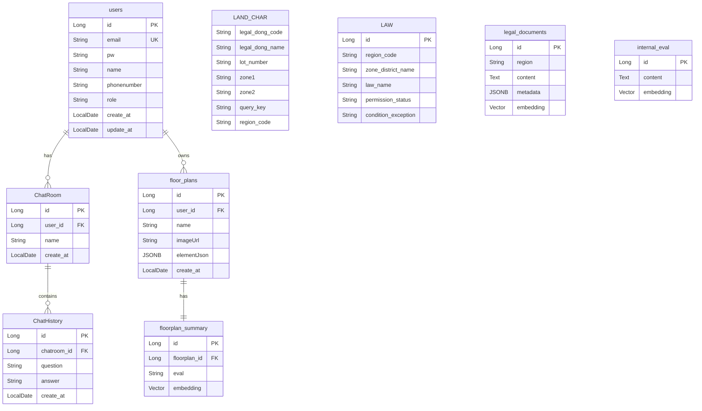
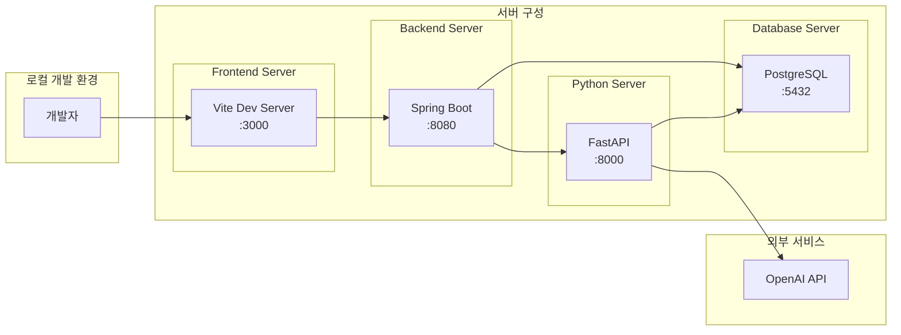

# 시스템 아키텍처

**SK Networks Family AI Camp 5기**
**프로젝트: 건축 도면 분석 및 법령 안내 시스템**

---

## 1. 컴포넌트 다이어그램

---

## 2. 시퀀스 다이어그램

### 2.1 도면 분석 흐름

### 2.2 챗봇 (RAG) 흐름

### 2.3 인증 흐름

---

## 3. 액티비티 다이어그램

### 3.1 도면 분석 프로세스

### 3.2 챗봇 RAG 프로세스

---

## 4. 전체 시스템 아키텍처

---

## 5. 데이터베이스 ERD

---

## 6. 배포 구성도

---

## 7. 기술 스택

| 계층 | 기술 | 버전 |
|------|------|------|
| **Frontend** | React | 18.x |
| | TypeScript | 5.x |
| | Vite | 5.x |
| | Axios | - |
| **Backend** | Spring Boot | 3.x |
| | Spring Security | - |
| | Spring Data JPA | - |
| | JWT | - |
| **Python** | FastAPI | - |
| | OpenAI API | GPT-4o |
| | psycopg2 | - |
| **Database** | PostgreSQL | 12+ |
| | pgvector | - |
| **AI/ML** | Vision AI | cv_inference_V3.6.2 |
| | Embeddings | text-embedding-3-small |

---

## 8. API 엔드포인트 요약

### Frontend → Backend

| 엔드포인트 | 메서드 | 설명 |
|-----------|--------|------|
| `/api/auth/login` | POST | 로그인 |
| `/api/auth/signup` | POST | 회원가입 |
| `/api/auth/me` | GET | 현재 사용자 정보 |
| `/api/chatbot/chat` | POST | 채팅 질문/답변 |
| `/api/chatbot/sessionuser` | POST | 채팅방 목록 |
| `/api/chatbot/roomhistory` | POST | 채팅 기록 |
| `/api/floorplan/analyze` | POST | 도면 분석 |
| `/api/floorplan/save` | POST | 분석 결과 저장 |

### Backend → Python

| 엔드포인트 | 메서드 | 설명 |
|-----------|--------|------|
| `/analyze` | POST | 도면 이미지 분석 |
| `/ask` | POST | RAG 질의응답 |

---

*작성일: 2025.02*
